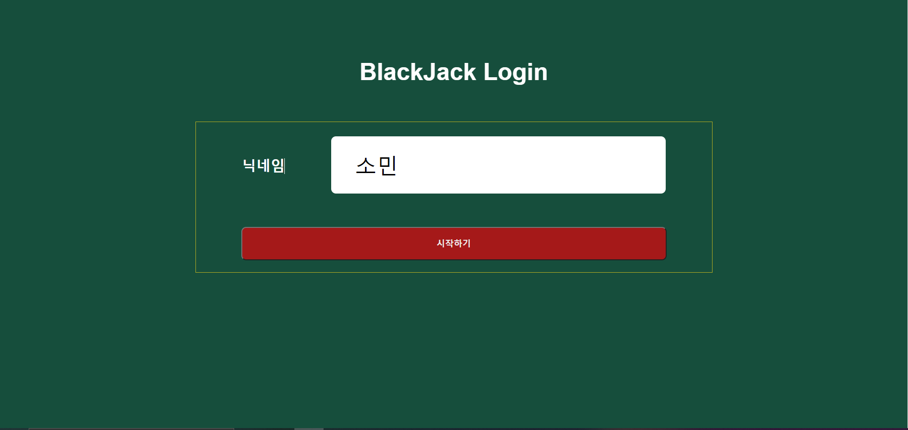
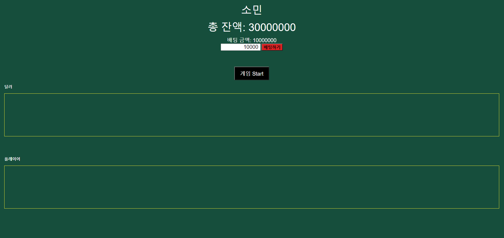
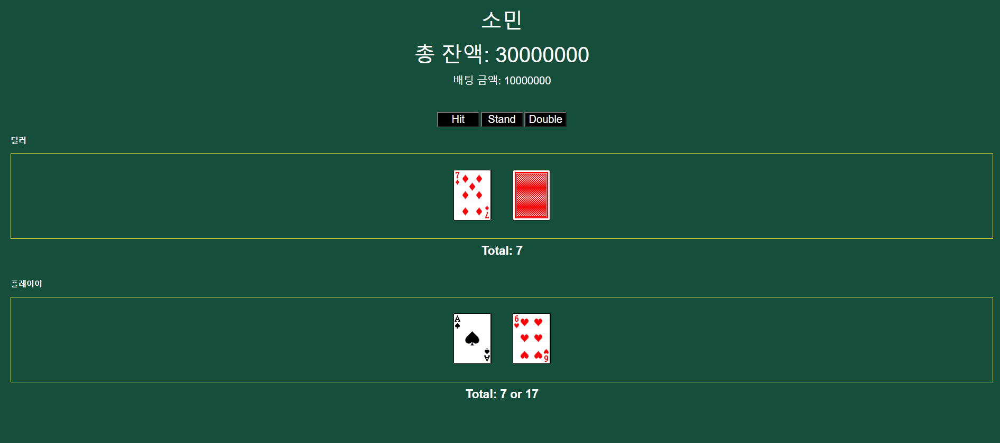
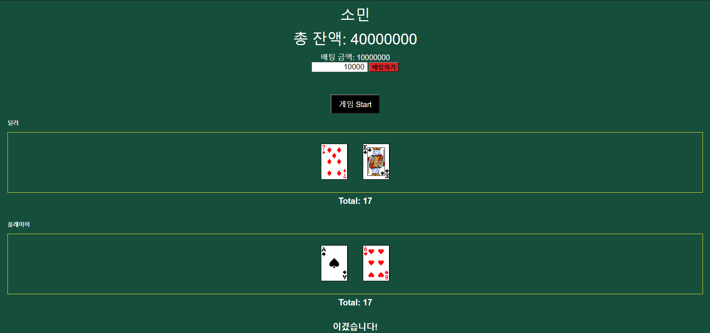
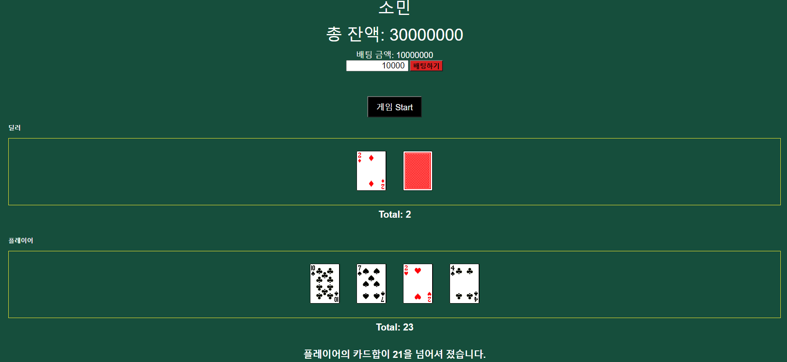

# 간단한 blackJack게임 사이트 만들기

Spring/Jsp/Ajax/mybatis를 이용한 간단한 블랙잭 게임 사이트

<br>
<br>

## Run

### 1. git clone

```sh
git clone https://github.com/gowoonsori/blackJack.git
```

### 2. jar 패키징

```sh
cd blackJack
mvn package
```

### 3. 실행

```sh
java -jar target/blackjack-1.0.0.jar
```

웹 브라우저를 이용해 localhost:8080/blackjack 접속

<br><br>

## 실행 모습

### 1. 로그인



### 2. 초기 화면



### 3. start



### 4. win



### 5. lose



### 6. split


<br><br>

## 개선할 점

- split 오류(처음 split선택에서 split안했을때 split선택가능한 문제)
- 사이트 다수유저 동시접속하여 게임실행 불가(Round 정보를 DB에 업데이트하도록 수정)
